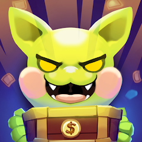
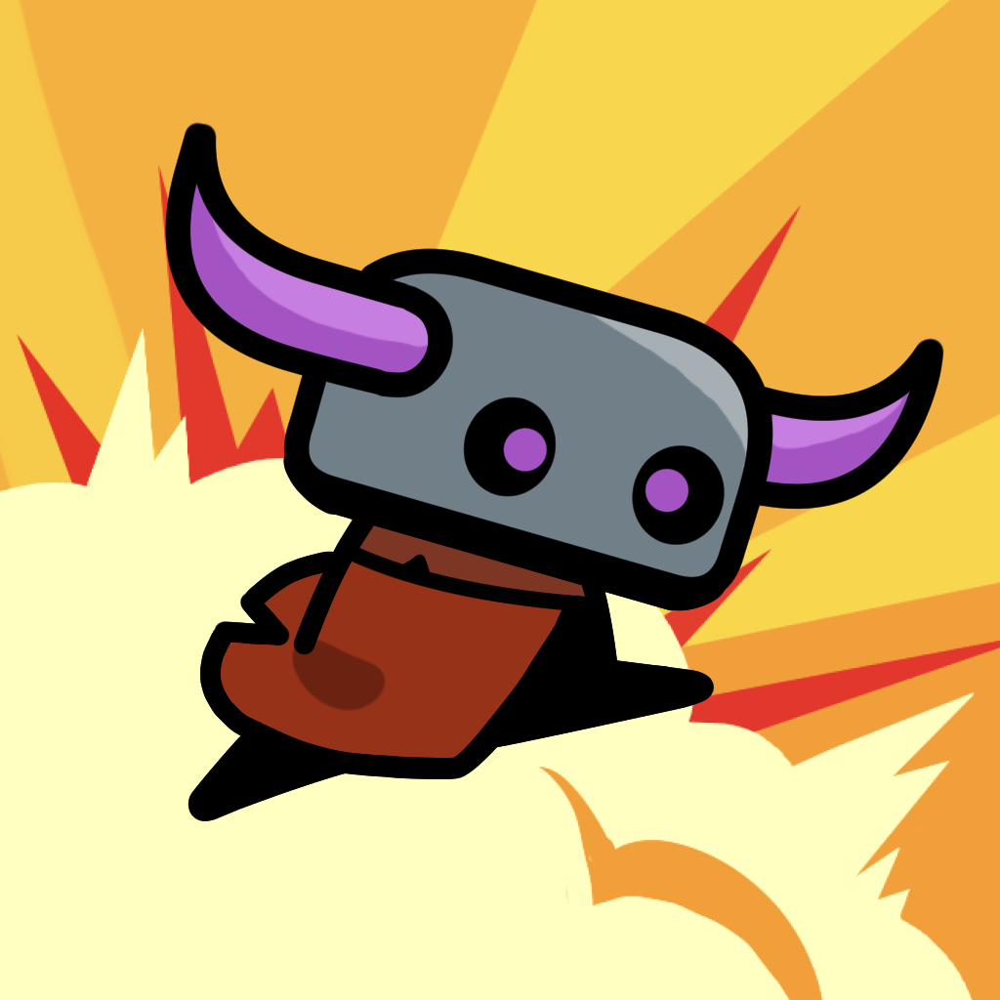
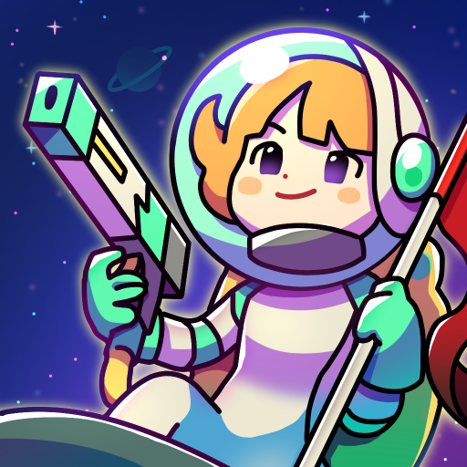
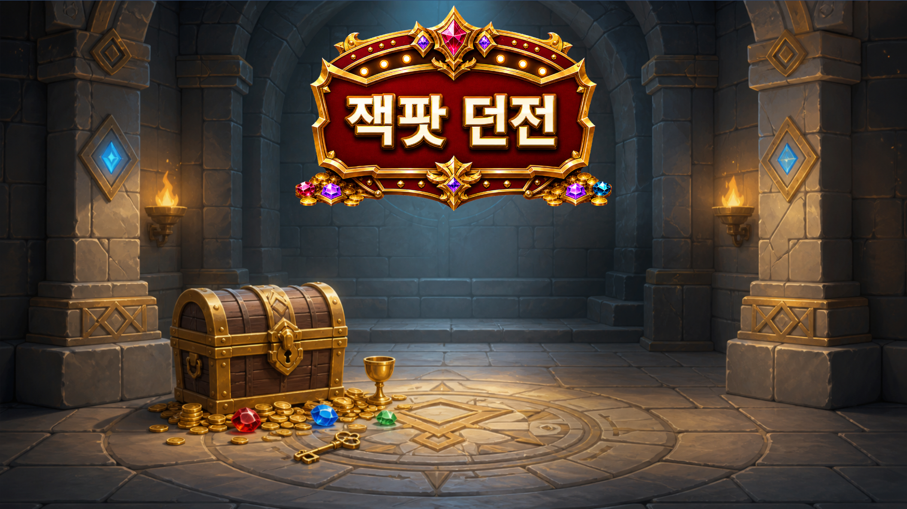

# Profile

## 보유 기술
C#(닷넷코어), AWS, 유니티, GoLang

---

 
 

## 소개 ##
첫 회사에서는 프로젝트를 진행함에 있어 여러 의견을 제시하여 게임의 일부분을 제 의견대로 구현할 수 있었습니다. 그러나 다음 회사에서는 전문적인 기획자 포지션의 인력이 있어 제 의견이 많이 반영되진 않았지만 좀 더 수월하게 개발을 진행할 수 있었습니다. 이때 각 포지션의 존재의 중요함을 깨달았습니다.

서버 프로그래머로서 항상 서버의 안정성과 관리하기 편한 로깅 서비스를 위해 생각합니다. 이를 위해 프로젝트마다 새로운 기술을 적용하여 어느 방법으로 효율적인 관리가 가능한지 고민을 하고 있습니다.

새로운 도전을 좋아하고 변화를 두려워하지 않습니다. 제 성격 또한 이것저것 하는 걸 좋아합니다. 제가 인생을 살아감에 있어서도 새로운 도전을 자주 해보는 편입니다. 직무상으로도 그렇고 생활에 있어서도 그렇고 새로운 도전들은 제 기분을 환기시켜주며, 일에 대한 원동력을 주기도 했습니다.

서브컬쳐 계열에 관심이 많습니다. 게임도 그렇고 만화 등도 그렇습니다. 최근에는 게임을 만든다고 해서 취미에 시간을 많이 쏟지 못하고 있지만 그래도 최신작을 가끔 해보거나 하고 있습니다. 또한 감각을 잃지 않기 위해 이른바 ‘숙제’라고 하는 행위로라도 계속해서 게임을 플레이 하고 있습니다. 현재 플레이 하고 있는 게임은 ‘프린세스 커넥트 리다이브’ ‘원신’ ‘영웅전설 가가브 트릴로지’ ‘블루아카이브’가 있습니다. 최근에는 ‘명일방주 엔드필드’를 경험한 적이 있습니다.

협업을 통해 제 기술의 수준을 이해하고 제 기술을 남들과 공유하여 회사에 인력을 제공하고, 회사가 갖고 있는 기술 및 동료들이 갖고 있는 기술의 습득을 하여 저 스스로도 성장해나가고 그것이 회사에 도움이 될 수 있는 선순환 구조가 되었으면 합니다.

 
 

## 참여 프로젝트 목차 ##

[애니멀 헌터스](#애니멀-헌터스-서비스-중)
 
[고블린 퀘스트](#고블린-퀘스트--idle-adventure-서비스-종료)
 
[갓 오브 방치](#갓-오브-방치-서비스-종료)
 
[유니버스타 디펜스](#유니버스타-디펜스-서비스-종료)
 
[머지드릴](#머지-드릴-서비스-종료-리버스-드라이브-서비스-종료-니트로-점프-서비스-종료)
 
[리버스 드라이브](#머지-드릴-서비스-종료-리버스-드라이브-서비스-종료-니트로-점프-서비스-종료)
 
[니트로 점프](#머지-드릴-서비스-종료-리버스-드라이브-서비스-종료-니트로-점프-서비스-종료)
 
[마계 전자](#마계전자-라이브-중)
 
[몬스터 대마왕 1호점](#몬스터-대마왕-1호점-서비스-종료)
 
[극한직업 용사의 매니저](#극한직업-용사의-매니저-라이브-중-중도-참여)

---

 
 

## 애니멀 헌터스 (서비스 중)

### 사용기술
C#, NoSQL DB(DynamoDB), RDB(MySQL), Redis, CI/CD(Code Pipeline), AutoScaling, VPC, 오케스트레이션(Elastic Beanstalk)

#### 게임 정보
- 장르: 캐주얼, 서바이벌
- 타겟: 시간 날 때 게임을 가볍게 즐기는 유저

 
 
 

## 고블린 퀘스트 : Idle Adventure (서비스 종료)

### 사용기술
GoLang, NoSQL DB(DynamoDB), 컨테이너 서비스(ECS), 오케스트레이션(Elastic Beanstalk)

#### 게임 정보
- 장르: 방치형 RPG

 
 
 

## 갓 오브 방치 (서비스 종료)

### 사용기술
C#, NoSQL DB(DynamoDB), RDB(MySQL), Redis, CI/CD(Code Pipeline), 오케스트레이션(Elastic Beanstalk)

#### 게임 정보
- 장르: 방치형 RPG

 
 
 

## 유니버스타 디펜스 (서비스 종료)

### 사용기술
C#, NoSQL DB(DynamoDB), RDB(MySQL), CI/CD(Code Pipeline), 오케스트레이션(Elastic Beanstalk), IaC(CDK)

#### 게임 정보
- 장르: 협동 디펜스
- 타겟: 디펜스 게임을 좋아하는 유저

 
 
 

## 머지 드릴 (서비스 종료), 리버스 드라이브 (서비스 종료), 니트로 점프 (서비스 종료)

### 사용기술
Node.js(JavaScript), RDB(MySQL), CI/CD(Code Pipeline), AWS Lambda

#### 게임 정보
- 장르: 하이퍼 캐주얼
- 타겟: 시간 날 때 게임을 가볍게 즐기는 유저

 
 
 

## 마계전자 (라이브 중)

### 사용기술
Node.js(JavaScript), NoSQL DB(DynamoDB), RDB(MySQL), AWS Lambda

 
 
 

## 몬스터 대마왕 1호점 (서비스 종료)

### 사용기술
Node.js(JavaScript), NoSQL DB(DynamoDB), RDB(MySQL), AWS Lambda

#### 게임 정보
- 장르: 방치형 RPG

 
 
 

## 극한직업 용사의 매니저 (라이브 중, 중도 참여)
### 사용기술
Node.js(JavaScript), RDB(MySQL), AWS Lambda

 
 

## 개인작 (AI 활용) ##

[잭팟던전(게임핑)](https://www.game-ping.kr/games/jackpot-dungeon)

[잭팟던전(스토브)](https://store.onstove.com/ko/games/105063)

 
 

[원신 성유물 추천기](https://kimchungho.github.io/GenshinArtifactRecommender/)