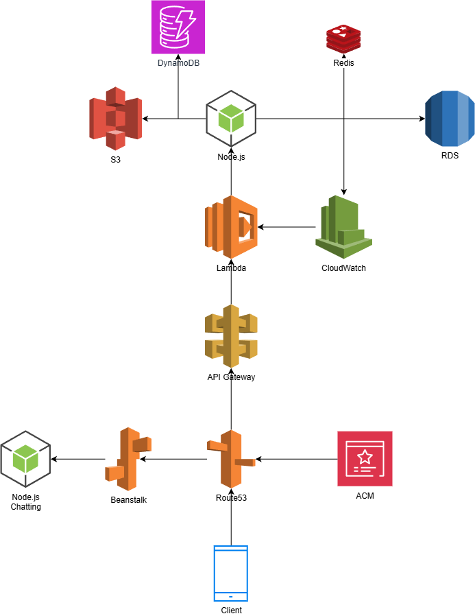
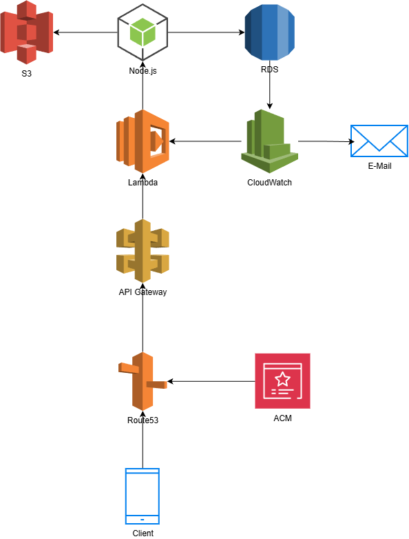

# Profile

## 보유 기술
C#(닷넷코어), AWS, 유니티, GoLang

---

 
 

## 소개 ##
첫 회사에서는 프로젝트를 진행함에 있어 여러 의견을 제시하여 게임의 일부분을 제 의견대로 구현할 수 있었습니다. 그러나 다음 회사에서는 전문적인 기획자 포지션의 인력이 있어 제 의견이 많이 반영되진 않았지만 좀 더 수월하게 개발을 진행할 수 있었습니다. 이때 각 포지션의 존재의 중요함을 깨달았습니다.

서버 프로그래머로서 항상 서버의 안정성과 관리하기 편한 로깅 서비스를 위해 생각합니다. 이를 위해 프로젝트마다 새로운 기술을 적용하여 어느 방법으로 효율적인 관리가 가능한지 고민을 하고 있습니다.

새로운 도전을 좋아하고 변화를 두려워하지 않습니다. 제 성격 또한 이것저것 하는 걸 좋아합니다. 제가 인생을 살아감에 있어서도 새로운 도전을 자주 해보는 편입니다. 직무상으로도 그렇고 생활에 있어서도 그렇고 새로운 도전들은 제 기분을 환기시켜주며, 일에 대한 원동력을 주기도 했습니다.

협업을 통해 제 기술의 수준을 이해하고 제 기술을 남들과 공유하여 회사에 인력을 제공하고, 회사가 갖고 있는 기술 및 동료들이 갖고 있는 기술의 습득을 하여 저 스스로도 성장해나가고 그것이 회사에 도움이 될 수 있는 선순환 구조가 되었으면 합니다.

 
 

## 참여 프로젝트 목차 ##

[애니멀 헌터스](#애니멀-헌터스-서비스-중)
 
[고블린 퀘스트](#고블린-퀘스트--idle-adventure-서비스-종료)
 
[갓 오브 방치](#갓-오브-방치-서비스-종료)
 
[유니버스타 디펜스](#유니버스타-디펜스-서비스-종료)
 
[머지드릴](#머지-드릴-서비스-종료-리버스-드라이브-서비스-종료-니트로-점프-서비스-종료)
 
[리버스 드라이브](#머지-드릴-서비스-종료-리버스-드라이브-서비스-종료-니트로-점프-서비스-종료)
 
[니트로 점프](#머지-드릴-서비스-종료-리버스-드라이브-서비스-종료-니트로-점프-서비스-종료)
 
[마계 전자](#마계전자-라이브-중)
 
[몬스터 대마왕 1호점](#몬스터-대마왕-1호점-서비스-종료)
 
[극한직업 용사의 매니저](#극한직업-용사의-매니저-라이브-중-중도-참여)

---

 
 

## 애니멀 헌터스 (서비스 중)

### 사용기술

C#, NoSQL DB(DynamoDB), RDB(MySQL), Redis, CI/CD(Code Pipeline), AutoScaling, VPC, 오케스트레이션(Elastic Beanstalk)

#### 게임 정보
- 장르: 캐주얼, 서바이벌
- 타겟: 시간 날 때 게임을 가볍게 즐기는 유저

#### 웹
- 각종 밸런스 어드민 페이지 제공
- 게임 테이블을 어드레서블 애셋 다운로드가 아닌 DB에서 관리
- 쿠폰 입력 기능

#### 서버
- Redis를 사용한 매칭 기능
- 세션 기능
- 서버 인스턴스 점검 시 Lambda 서비스를 통해 게임 내 점검 안내 기능
- 버전 체크 기능
- 구글, 애플 영수증 검증 기능
- 출석 기능
- 주간, 월간 랭킹
- 각 캐릭터 별 스탯 레벨업
- 전투 종료 시 업적 및 이벤트 데이터 업데이트
- 데디케이트 서버에서의 방 관리 기능

#### 인프라
- SES로 보낸 마케팅 벌크 메일들을 n8n을 통해 gmail에 수신되는 이메일을 Bedrock으로 분석하여 구글 시트에 추가
- pulumi를 통해 데디케이트 서버에 필요한 데이터를 EC2 템플릿에 추가하여 인스턴스 생성
- AutoScalling을 통해 자동 스케일 아웃
- 리전 별 EC2 인스턴스를 VPC를 통해 하나의 Redis로 접속

#### 운영 및 테스트
- 인스턴스 1개 당 50개의 방을 생성하여 서울, 프랑크푸르트, 버지니아 북부 리전 3개에 걸쳐 관리

 
 
 

## 고블린 퀘스트 : Idle Adventure (서비스 종료)

### 사용기술

GoLang, NoSQL DB(DynamoDB), 컨테이너 서비스(ECS), 오케스트레이션(Elastic Beanstalk)

#### 게임 정보
- 장르: 방치형 RPG

#### 작업 내용
- NHN 게임베이스의 API를 사용한 영수증 검증.
- CloudFront, S3를 통해 게임 테이블 다운로드 기능.
- 서버 인스턴스 점검 시 Lambda 서비스를 통해 게임 내 점검 안내 기능.
- 게임 패스 기능.
- 미션 기능.
- 미니게임(룰렛).
- 출석 보상.
- 뽑기 기능.
- 조건 충족 시 인앱상품 트리거되는 기능.
- 우편을 통한 아이템 지급 기능.

#### 운영 및 테스트
- 로커스트 툴을 통해 최소 2000명 까지 커버 가능한 것을 확인

 
 
 

## 갓 오브 방치 (서비스 종료)

### 사용기술

C#, NoSQL DB(DynamoDB), RDB(MySQL), Redis, CI/CD(Code Pipeline), 오케스트레이션(Elastic Beanstalk)

#### 게임 정보
- 장르: 방치형 RPG

#### RDB(MySQL)
- 회원가입 및 로그인 기능 구현
- 밴 기능 구현
- 이벤트 기능 구현
- 우편 기능 구현
- 세션 기능 구현
- 버전 체크 기능 구현
- 던전 컨텐츠 랭킹 기능 구현
- 공지 기능 구현

#### 작업 내용
- 구글, 애플의 API를 통한 구매 영수증 검증.
- CloudWatch를 통한 로깅.
- 꿈의 집 같은 저택 청소 컨텐츠 구현(유니티).
- 룰렛 기능 구현.

#### 운영 및 테스트
- 더미 클라이언트를 통해 1000명 이상의 유저 커버 가능성 확인

 
 
 

## 유니버스타 디펜스 (서비스 종료)

### 사용기술
(변경 전)
 

 
 
(변경 후)
 

C#, NoSQL DB(DynamoDB), RDB(MySQL), CI/CD(Code Pipeline), 오케스트레이션(Elastic Beanstalk), IaC(CDK)

#### 게임 정보
- 장르: 협동 디펜스
- 타겟: 디펜스 게임을 좋아하는 유저

#### RDB(MySQL)
- 회원가입 및 로그인 기능 구현
- 밴 기능 구현
- 이벤트 기능 구현
- 우편 기능 구현
- 2인 협동전 랭킹 기능 구현(AI유저 포함)
- 리세마라용 10연속 뽑기 기능 구현
- 일반 뽑기 기능 구현
- 세션 기능 구현
- 버전 체크 기능 구현

#### 유니티

#### Photon 엔진

#### 작업 내용
- Lambda에 CDK를 통해 배포.
- 구글, 애플의 API를 통한 구매 영수증 검증.
- 중간에 asp로 서버 변경. EB를 통해 EC2 인스턴스에 서버 띄움. 이유는 Lambda의 콜드 스타트가 기존의 node.js보다 느리고 인스턴스가 내려가는 시간 이 더 빨랐기 때문.
- 소켓통신을 통해 pvp 대전 컨텐츠 구현. 개발 도중에 코드 폐기.
- CodePipeline을 통한 코드 자동 배포.
- xml 파일을 제너레이터를 통해 통신 스펙 코드 자동 생성.
- 클라이언트용 통신 모듈(Sender, Receiver) 구현.
- 테스트, 개발, 프로덕트 서버 구분 기능 구현.

#### 서버 기능 구현 내용
- RDB를 이용하여 로그인, 세션 ID를 구현. 동시접속을 막음.
- 배틀패스 기능 구현.
- 뽑기 픽업 기능 구현. 픽업을 유저가 바꿀 수 있음.
- 유닛 클래스, 레벨업 시스템 구현.
- 협업 컨텐츠 랭킹 구현. 2인 1조이기 때문에 팀원이 다르면 새로 업로드되게 함.
- 일일미션 시스템 구현.
- 일일 접속보상 시스템 구현.
- 유닛 덱 시스템 구현.
- 뽑기 구현.
- 공지사항 시스템 구현.
- 우편 시스템 구현
- 마일리지 뽑기 구현.

#### 운영 및 테스트
- XUnit을 통해 모든 코드 테스트.
- 수십 명 단위의 유저 커버 확인.

 
 
 

## 머지 드릴 (서비스 종료), 리버스 드라이브 (서비스 종료), 니트로 점프 (서비스 종료)

### 사용기술

Node.js(JavaScript), RDB(MySQL), CI/CD(Code Pipeline), AWS Lambda

#### 게임 정보
- 장르: 하이퍼 캐주얼
- 타겟: 시간 날 때 게임을 가볍게 즐기는 유저

#### 유니티

#### 작업 내용
- Lambda에 개별 파일을 통해 배포.
- 구글, 애플의 API를 통한 구매 영수증 검증.
- S3에 유저들의 데이터 백업.
- 자사의 광고영상을 다운로드하여 일정 조건마다 동영상 플레이어를 통해 재생.

 
 
 

## 마계전자 (라이브 중)

### 사용기술

Node.js(JavaScript), NoSQL DB(DynamoDB), RDB(MySQL), AWS Lambda

#### RDB(MySQL)
- 회원가입 및 로그인 기능 구현
- 밴 기능 구현
- 이벤트 기능 구현
- 우편 기능 구현
- pvp 기능 구현
- 핫타임 기능 구현
- 시즌 별 보스 도전 컨텐츠 구현(자동 교체 포함)
- 길드 기능 구현
- 공지사항 기능 구현
- 세션 기능 구현
- 버전 체크 기능 구현
- 시즌 기능 구현(시즌에 맞춰 해당하는 패키지를 판매)
- pvp 히스토리 기능 구현

#### 유니티
- 채팅 모듈

#### 웹
- 부트스트랩
- socket.io

#### 작업 내용
- Lambda에 개별 파일을 통해 배포.
- 구글, 애플의 API를 통한 구매 영수증 검증.
- S3에 유저들의 데이터 백업.
- CloudWatch 경보를 통해 RDS 인스턴스의 CPU 사용률이 급격히 높아질 경우 메일로 알림을 보냄.
- node.js로 채팅 서버를 구현. 각 언어에 맞게 채널을 구분.
- Redis를 통해 채팅 메시지를 임시로 저장하고 있다가 정해진 시간마다 S3에 백업.
- Redis를 통해 랭킹 컨텐츠의 순위를 저장.
- 유니티에 채팅 모듈을 구현함. UI를 통해 채팅 메시지를 띄우고, 채팅 메시지의 특정 부분 클릭 시 커스텀 태그 기능이 작동하도록 구현.
- 웹으로 어드민 페이지를 구현하여 채팅 메시지를 확인하고 유저 밴 처리와 우편 보내기 기능을 구현.
- DynamoDB에 서버 로깅.
- CloudWatch 이벤트를 통해 cron 시스템을 구현. 일정 기간마다 랭킹전 컨텐츠의 보스가 교체되도록 구현.
- 길드 시스템 구현.
- 일일, 주간, 시즌 보상 자동 지급 시스템 구현.
- 아이템 지급 이벤트 시스템 구현.

#### 운영 및 테스트
- 글로벌 피쳐드로 인하여 단기간 유저 대폭 증가. 유저가 많이 접속하면 오토스케일링을 통해 자동으로 인스턴스가 늘어나게 만듦. 500명 이상 커버 경험.
- 다수의 인스턴스 생성 시에도 socket.io-redis 패키지를 통해 서버끼리 통신이 가능하게 하여 관리

 
 
 

## 몬스터 대마왕 1호점 (서비스 종료)

### 사용기술

Node.js(JavaScript), NoSQL DB(DynamoDB), RDB(MySQL), AWS Lambda

#### 게임 정보
- 장르: 방치형 RPG

#### DynamoDB
- 로깅.
- 회원가입 및 로그인 기능 구현
- 밴 기능 구현
- 이벤트 기능 구현
- 우편 기능 구현
- 버전 체크 기능 구현

#### 작업 내용
- Lambda에 개별 파일을 통해 배포.
- 구글, 애플의 API를 통한 구매 영수증 검증.
- S3에 유저들의 데이터 백업.

 
 
 

## 극한직업 용사의 매니저 (라이브 중, 중도 참여)
### 사용기술

Node.js(JavaScript), RDB(MySQL), AWS Lambda

#### 작업 내용
- EC2로 운영되던 서버를 AWS의 Lambda에 서버리스로 서비스되게 변경. 코드 관리 및 배포의 용이성 증가.
- Lambda에 개별 파일을 통해 배포.
- CloudWatch 경보를 통해 RDS 인스턴스의 CPU 사용률이 급격히 높아질 경우 메일로 알림을 보냄.
- 기존 EBS에 백업되던 유저들의 데이터를 S3로 마이그레이션.

 
 

## 개인작 (AI 활용) ##

[잭팟던전](https://www.game-ping.kr/games/jackpot-dungeon)

 
 

[원신 성유물 추천기](https://kimchungho.github.io/GenshinArtifactRecommender/)